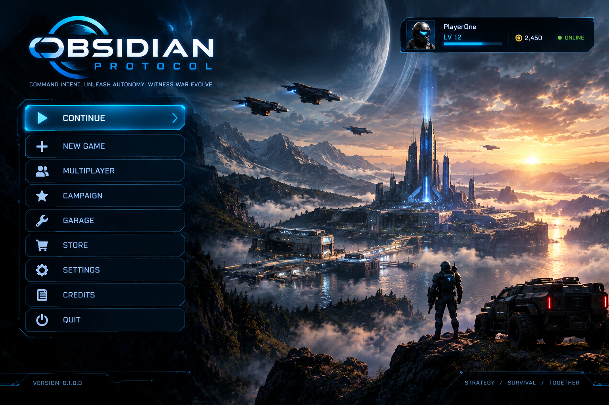
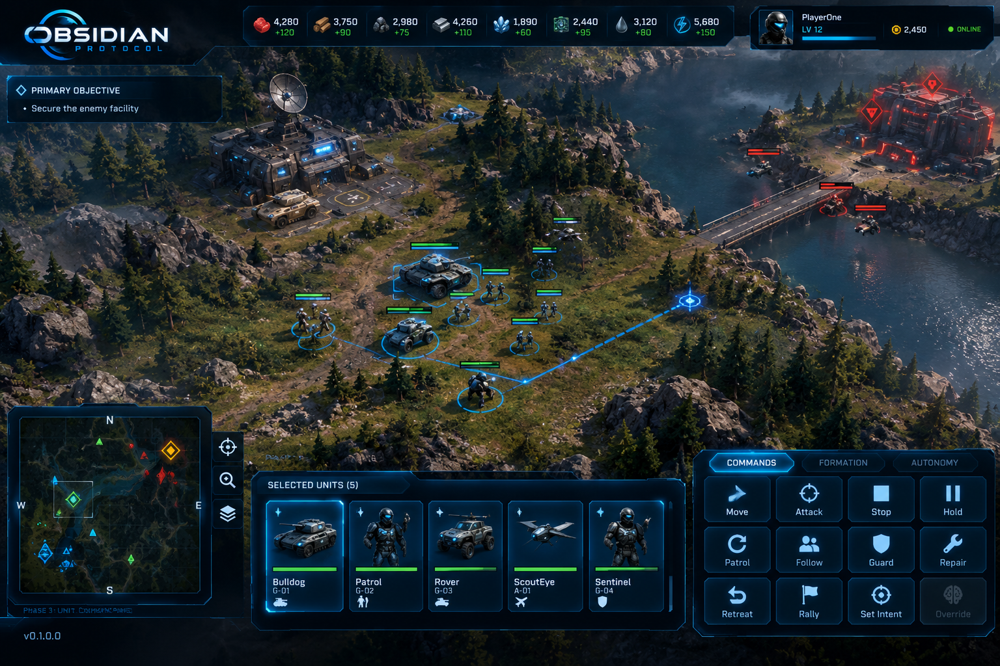
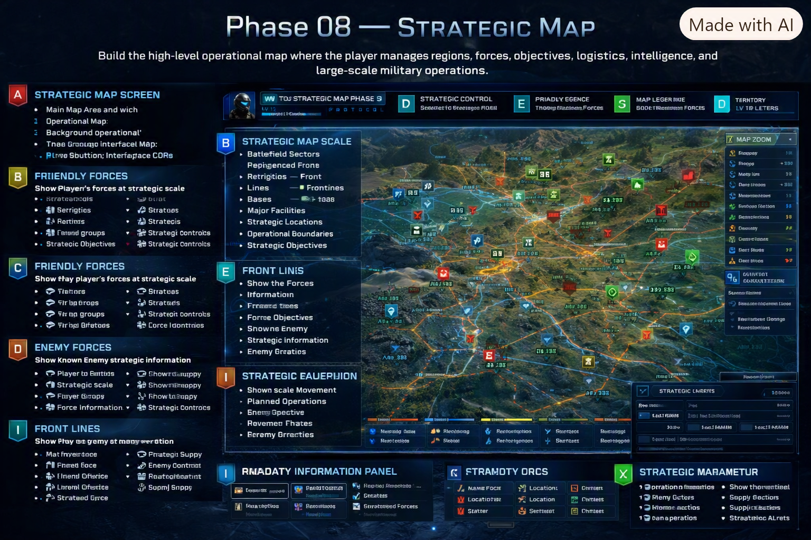

<div align="center">


<br>



# OBSIDIAN PROTOCOL
### AUTONOMOUS WARFARE

**A strategy game about commanding intent—not clicking faster.**

[](ProjectSettings/ProjectVersion.txt)
[](#where-we-are)
[](#join-the-operation)

<br>

**[Join the operation](#join-the-operation)** ·
**[Run the prototype](#run-the-project)** ·
**[Read the vision](Docs/Design)** ·
**[Browse the issues](https://github.com/jasonfetterman/ObsidianProtocol-Autonomous-Warfare/issues)**

</div>

---

## The hook

You give a formation a mission. Its commander decides how to pursue it.

Sensors fail. Contacts remain unidentified. A relay goes dark. A damaged vehicle
breaks formation. Supply routes become targets. The battle that follows is not a
scripted sequence—it is the consequence of your orders, your doctrine, and what
your military actually knows.

> **You do not command every move. You command the war.**

Obsidian Protocol is an original military strategy game being built in Unity. It
combines strategic planning, autonomous forces, imperfect information, logistics,
and tactical intervention in one continuous command experience.

## What makes it different?

<table>
<tr>
<td width="25%" align="center"><h3>🎖️</h3><b>Intent</b><br><sub>Set objectives, priorities, doctrine, and risk.</sub></td>
<td width="25%" align="center"><h3>🤖</h3><b>Autonomy</b><br><sub>Commanders and units interpret your orders.</sub></td>
<td width="25%" align="center"><h3>📡</h3><b>Uncertainty</b><br><sub>Knowledge depends on sensors and comms.</sub></td>
<td width="25%" align="center"><h3>⚙️</h3><b>Consequences</b><br><sub>Damage, supply, and decisions persist.</sub></td>
</tr>
</table>

### A battle is a chain reaction

```text
MISSION
   ↓
COMMAND INTENT → DOCTRINE → AUTONOMOUS DECISIONS
                                      ↓
                         SENSORS · COMMS · TERRAIN · LOGISTICS
                                      ↓
                              AN UNPREDICTABLE BATTLE
```

You can stay above the fight, shaping the whole operation, or take control of a
single drone, vehicle, or reconnaissance platform when the moment demands it.
The military keeps moving when you step back out.

## The world we are building

<p align="center">
  
  
</p>

| Layer | The player does |
| --- | --- |
| **Strategic** | Build a persistent force, select objectives, plan deployments, and manage the campaign. |
| **Operational** | Assign commanders, shape doctrine, route logistics, maintain communications, and adapt to intelligence. |
| **Tactical** | Direct squads, exploit terrain, react to contact reports, and intervene when autonomy is not enough. |
| **Personal** | Walk the command facility, inspect the fleet, and jump directly into controllable units. |

The planned force spans **air, ground, naval, command, logistics, reconnaissance,
and experimental systems**. Online warfare, offline operations, and optional VR
command are part of the long-term direction.

## Where we are

**This is an active early-development project, not a finished game.**

The repository already contains a substantial Unity foundation: command and
selection systems, AI commander frameworks, sensors and intelligence, logistics,
combat, navigation, construction, Garage/fleet systems, deployment, persistence,
and multiplayer architecture. Scenes and interfaces are being wired together
while the underlying simulation continues to evolve.

That means:

- Some systems are functional prototypes; others are scaffolding or design targets.
- APIs, folder structure, and gameplay rules may change.
- A bug report, test scene, UI pass, or well-scoped system improvement can have real impact.
- Screenshots and concept art show direction, not a promise that every feature is playable today.

## Join the operation

You do **not** need to know the entire codebase to help. Pick a lane:

| If you are a... | You could help with... |
| --- | --- |
| **Unity / C# developer** | Runtime systems, editor tooling, scene wiring, save/load, profiling |
| **AI / simulation designer** | Commander decisions, formations, sensor fusion, emergent behavior |
| **Gameplay designer** | Orders, doctrine, logistics rules, missions, balance, player feedback |
| **UI/UX designer** | Tactical HUD, Garage flow, onboarding, accessibility, information clarity |
| **Artist / technical artist** | Units, facilities, environments, VFX, materials, interface polish |
| **Tester / player** | Reproduction steps, playtest notes, profiling captures, regression checks |
| **Writer / world-builder** | Factions, maps, missions, unit identity, documentation |

### A good first contribution

1. Browse the [open issues](https://github.com/jasonfetterman/ObsidianProtocol-Autonomous-Warfare/issues).
2. Look for `good first issue` or `help wanted`, or open a focused issue of your own.
3. For a larger gameplay or architecture change, discuss the direction before coding.
4. Make one small, complete change on a feature branch.
5. Test it in Unity and open a pull request with screenshots or reproduction notes.

Start with [`Docs/Design`](Docs/Design) for the vision, [`Assets/Game`](Assets/Game)
for runtime systems, and [`Assets/Data`](Assets/Data) for authored definitions.

## Run the project

### Requirements

- [Unity Hub](https://unity.com/download)
- **Unity `6000.0.80f1`** — see [`ProjectVersion.txt`](ProjectSettings/ProjectVersion.txt)
- Git
- Windows is the primary development target

### Open a scene

```text
1. Clone the repository.
2. Add it to Unity Hub.
3. Open it with Unity 6000.0.80f1.
4. Open Assets/Scenes/Core/Core.unity
   (or MainHUD/MainHUD.unity or PauseMenu/PauseMenu.unity).
5. Press Play and check the Console.
```

Keep commits focused. Do not commit Unity-generated folders such as `Library/`,
`Temp/`, or `Logs/`.

## Explore the repository

| Start here | What you will find |
| --- | --- |
| [`Docs/Design`](Docs/Design) | Game vision, maps, systems, and reference material |
| [`Assets/Game`](Assets/Game) | Runtime code organized by gameplay domain |
| [`Assets/Data`](Assets/Data) | Units, maps, technology, and authored definitions |
| [`Assets/Scenes`](Assets/Scenes) | Current Unity scenes and playable surfaces |
| [`Assets/Art/Concepts`](Assets/Art/Concepts) | HUD, facility, map, unit, and world direction |
| [`Tools/ThirdParty`](Tools/ThirdParty) | Imported learning and reference material |

## Ready to command?

Whether you want to build autonomous AI, design a better command interface,
create a battlefield, test a logistics rule, or simply make the next playtest
clearer, there is work waiting.

**Bring your specialty. Help us define what it feels like to command a living war.**

## License

Obsidian Protocol: Autonomous Warfare, including its code, game design, world,
branding, artwork, and other original content, is proprietary to the project
owner. Contributions become part of this project. Do not reproduce, redistribute,
resell, or create a competing game from this repository without written authorization.

<div align="center">

---

**Command intent. Unleash autonomy. Witness war evolve.**

</div>
