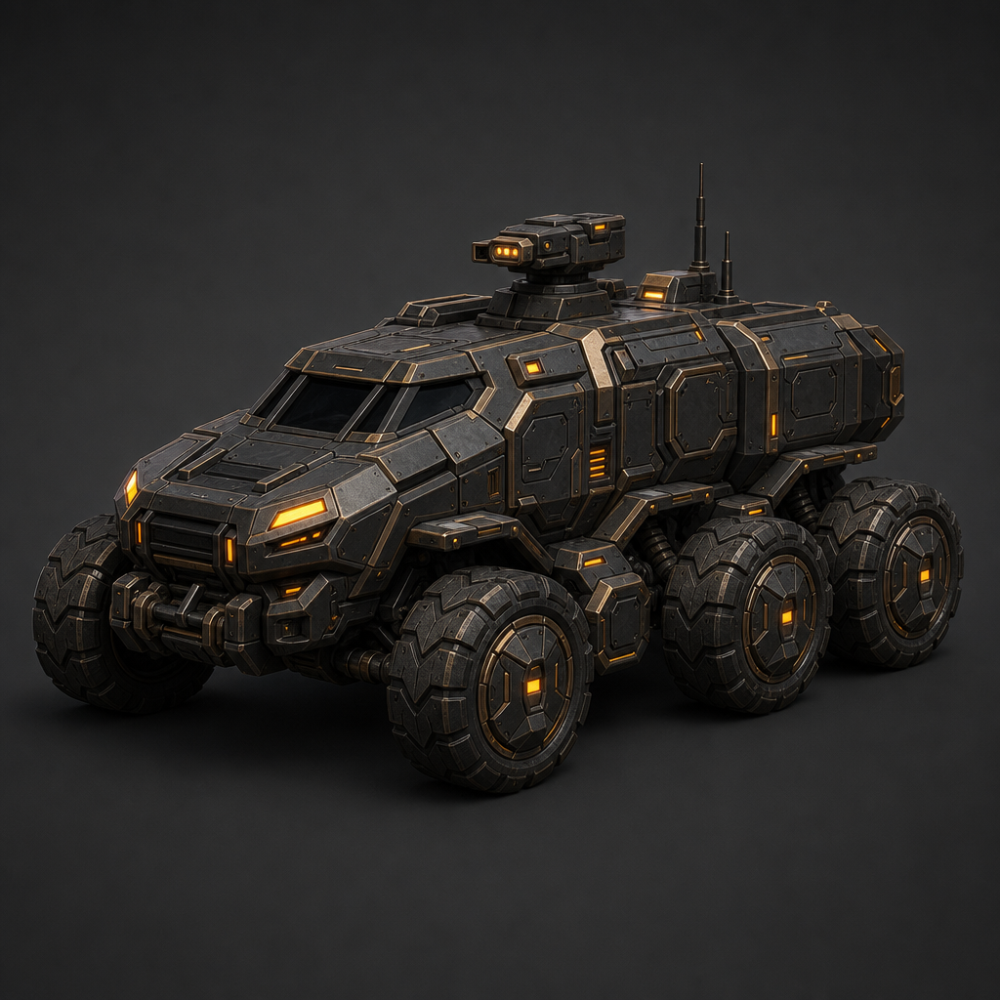
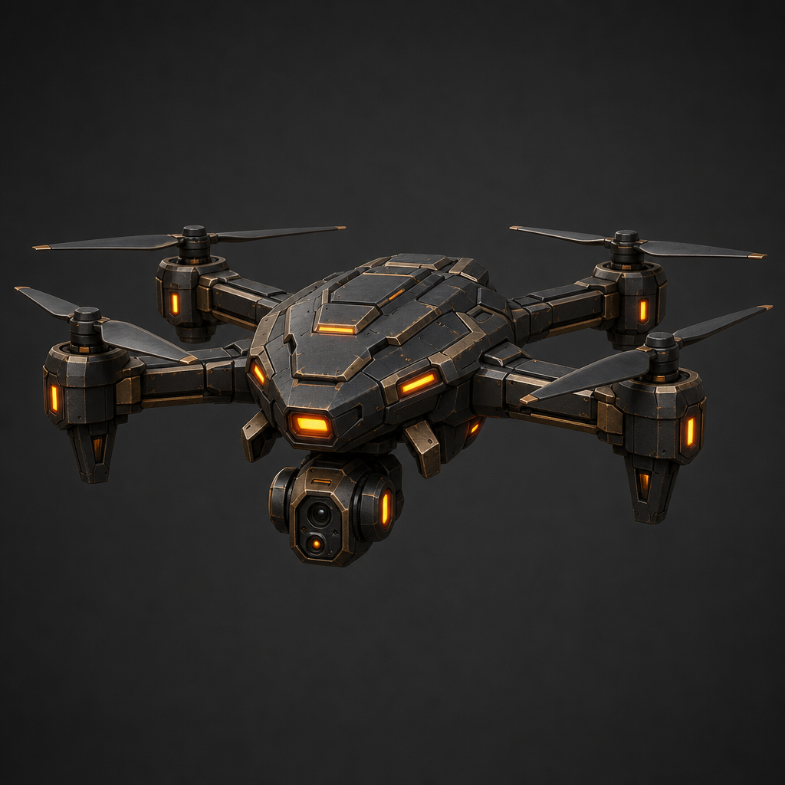
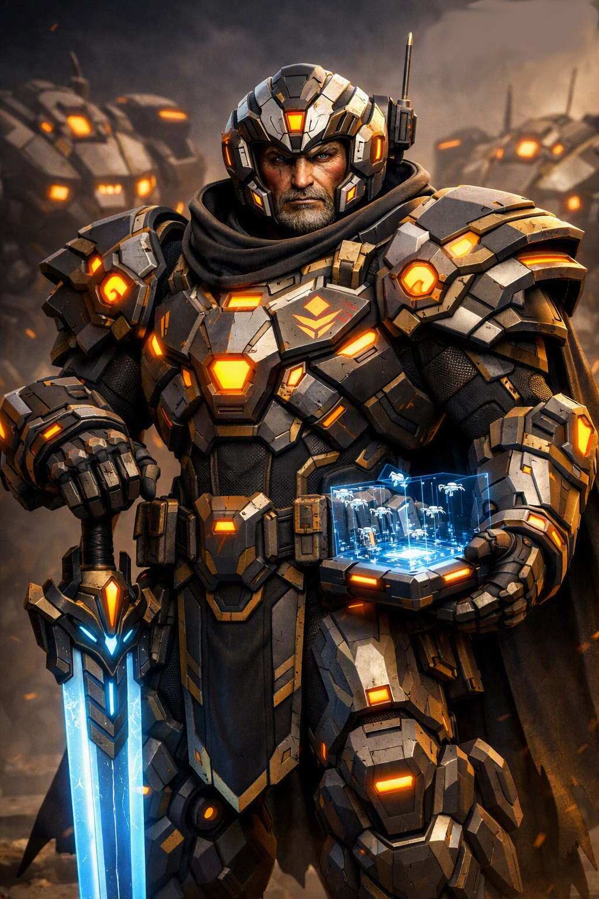

# Obsidian Protocol: Autonomous Warfare

> **Command intent. Unleash autonomy. Witness war evolve.**

Obsidian Protocol: Autonomous Warfare is a military strategy and warfare simulation built around a simple idea:

> **You do not command every move. You command the war.**

Instead of micromanaging every unit, the player establishes objectives, priorities, rules of engagement, formations, doctrines, and operational intent. Autonomous forces interpret those orders according to their capabilities, sensors, communications, role, condition, and understanding of the battlefield.

## Visual direction

The project’s visual language combines dark industrial armor, warm amber systems lighting, autonomous platforms, and human command leadership.

<p align="center">
  
  
  
</p>

These concept images represent the intended relationship between autonomous vehicles, reconnaissance systems, and the commander directing them.

## The vision

Obsidian Protocol is designed to make the player feel like a commander rather than a cursor controlling a collection of game pieces.

- **Command intent:** Define what a force must accomplish, including priorities, constraints, and acceptable risk.
- **Autonomous warfare:** Units, formations, and commanders make decisions within their orders and doctrine.
- **Imperfect information:** Detection, identification, communications, terrain, weather, and time all shape what a force knows.
- **Information warfare:** Blind the enemy, disrupt communications, destroy reconnaissance, and exploit gaps in situational awareness.
- **Persistent military:** Acquire, repair, configure, organize, and deploy a force that carries its history between battles.
- **Logistics:** Resources, maintenance, manufacturing, preparation, and supply determine how long a force can remain effective.
- **Multiplayer competition:** Commanders compete through planning, positioning, information, autonomy, logistics, and adaptation.
- **VR command:** Operate from inside the military facility and interact with battlefield intelligence through an immersive command experience.

## Command intent

Orders can be simple or operationally detailed:

```text
Secure the northern approach.
Maintain reconnaissance coverage.
Avoid unnecessary losses.
Withdraw if communications are lost.
```

Possible objectives include:

**Attack** · **Defend** · **Recon** · **Support** · **Escort** · **Retreat** · **Hold** · **Pursue** · **Flank** · **Suppress** · **Breach** · **Reinforce** · **Recover**

The same order can produce different results depending on the force receiving it, the information available, the condition of its equipment, and the situation developing around it.

## A battlefield that evolves

Battles are not intended to be predetermined sequences. Systems interact continuously:

1. Sensors detect and classify contacts.
2. Units share information through command and communications networks.
3. Commanders interpret orders and available intelligence.
4. Forces respond to threats, terrain, weather, damage, and changing objectives.
5. Communications can degrade, information can become stale, and units can become isolated.

The result is a battlefield capable of producing situations that were not explicitly scripted. A reconnaissance drone may discover an unexpected force, a destroyed relay may fragment a formation, or a damaged vehicle may withdraw instead of continuing an attack.

## Build a military, not just an army

The project supports a persistent force made up of multiple operational categories:

### Air units

Reconnaissance drones, sensor platforms, support aircraft, search-and-rescue systems, relays, surveillance platforms, and specialized autonomous aircraft.

### Ground units

Combat vehicles, patrol systems, recovery vehicles, logistics platforms, reconnaissance units, heavy machines, and specialized ground systems.

### Naval units

Surface vessels, reconnaissance platforms, sonar systems, rescue vessels, harbor systems, and specialized naval units.

### Command units

Strategic coordination, intelligence, communications, and battlefield management platforms.

### Experimental units

Restricted and advanced systems built around technologies that can fundamentally change battlefield behavior.

Between battles, the military can be acquired, maintained, repaired, configured, organized, analyzed, and prepared for its next deployment. Ownership is separate from battlefield power: multiplayer operations use a deployment budget so that the decision is not simply to bring everything.

## Logistics and operational pressure

Military power depends on support. Equipment requires materials, damaged systems require repair, manufacturing requires preparation, and sustained operations create logistical pressure.

The strategic question is not only whether a force can win an engagement, but whether it can continue operating afterward. A commander who wins every fight while destroying the ability to maintain the force may still lose the war.

## The physical military facility

The Garage is intended to be more than a menu. It is a physical command and maintenance facility where players can:

- Inspect vehicles and aircraft
- Visit maintenance and fabrication areas
- Review the fleet
- Access command systems
- Prepare deployments
- Move through specialized operational spaces

The goal is for the military to feel like something the player inhabits, not only a set of icons on a screen.

## Full VR command

VR is intended as a complete way to inhabit the military rather than an isolated minigame. The planned command experience includes:

- Immersive command-facility navigation
- Equipment inspection
- Operational interfaces
- Battlefield intelligence review
- Force monitoring
- Deployment preparation
- Sensor and information displays

## Living-world systems

The battlefield is affected by more than unit statistics. Time of day, weather, visibility, terrain, communications, and environmental conditions influence movement, detection, coordination, and operations.

A reconnaissance plan that works in daylight may fail at night. A communications network that works across open terrain may degrade in difficult environments. The battlefield itself is part of the tactical problem.

## Project structure

This repository contains the Unity project source:

```text
Assets/
├── Animations/       Animation assets and controllers
├── Art/              Concepts, models, textures, and visual assets
├── Audio/            Music, ambience, voice, and sound effects
├── Data/             Game data and configuration assets
│   └── Units/        Air, command, ground, and sea unit definitions
├── Debug/            Development and diagnostic tools
├── Editor/           Unity editor tooling
├── Equipment/        Equipment and loadout assets
├── Game/             Core game content
├── Maps/             Battlefield and map assets
├── Scenes/           Unity scenes
├── Scripts/          Gameplay and systems code
├── Settings/         Project and runtime settings
├── Tests/            Project tests
├── UI/               User-interface assets
├── VFX/              Visual effects
└── Weapons/          Weapon assets and systems
Packages/             Unity package manifest
ProjectSettings/     Unity project settings
```

The imported unit catalog is organized into:

- `Assets/Data/Units/Air_Units`
- `Assets/Data/Units/Command`
- `Assets/Data/Units/Ground_Units`
- `Assets/Data/Units/Sea_Units`

## Getting started

### Requirements

- Unity **6000.0.80f1**
- A Windows development environment suitable for Unity
- Git and enough disk space for Unity's generated project cache

### Open the project

1. Clone the repository.
2. Open Unity Hub.
3. Select **Add** and choose the cloned repository folder.
4. Open the project with Unity `6000.0.80f1`.
5. Allow Unity to import assets and resolve packages.
6. Open a scene from `Assets/Scenes/` and press Play.

Unity-generated folders such as `Library`, `Logs`, `Temp`, `Obj`, and `UserSettings` are intentionally excluded from version control. Unity recreates them locally when the project is opened.

## Development status

Obsidian Protocol is an active development project. The systems and vision described here represent the direction of the game and may evolve as implementation continues. Some features are prototypes, works in progress, or design targets rather than finished player-facing functionality.

## Contributing

Keep changes focused on the relevant gameplay system or content area. Before submitting changes:

- Open the project in the required Unity version.
- Confirm modified scenes and assets import without errors.
- Test the affected behavior in Play Mode.
- Do not commit generated Unity caches or local editor settings.

## License

No license has been declared for this repository yet. Until one is added, all rights are reserved by the project owner.

---

**Command intent. Unleash autonomy. Witness war evolve.**
