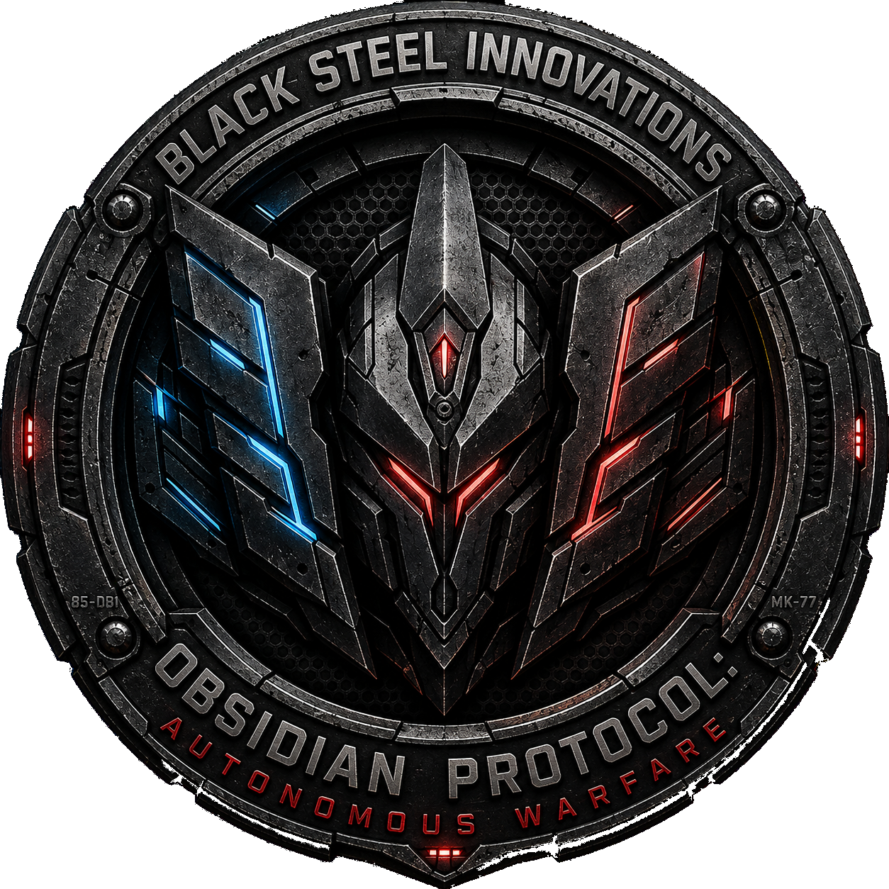

<strong>Command intent. Unleash autonomy. Witness war evolve.</strong>

⚫ Obsidian Protocol: Autonomous Warfare
A next‑generation autonomous RTS forged in conflict and commanded by steel.

Obsidian Protocol is a futuristic real‑time strategy game where autonomous squads think for themselves, battlefields evolve dynamically, and every engagement feels like a cinematic war story unfolding in real time.

Built for scale.
Built for modding.
Built for players who crave intelligent, emergent combat.

⭐ Why People Will Want This Game
Battles feel alive — squads flank, retreat, take cover, and coordinate without micromanagement

The world reacts — fog‑of‑war, destructible cover, elevation, suppression, visibility cones

AI behaves like a commander — breach tactics, siege logic, multi‑angle assaults

Modular systems let you build factions, units, tech trees, and campaigns without rewriting core code

Designed for massive battles without killing performance

Obsidian Protocol isn’t just an RTS.
It’s a living battlefield simulator where every squad has intent, every decision has weight, and every fight tells a story.

🛡️ The Warden Program — Primary Faction
Obsidian Protocol’s first major release centers on Black Steel Innovations’ Warden Program, a fully autonomous military fleet divided into four divisions:

✈️ Air Division
Recon, strike craft, and aerial dominance.
Units include: Warden, Beacon, Sentinel, Scouteye, Overstrig

🚢 Sea Division
Naval artillery, carriers, and coastal control.
Units include: Slunt Deffm, Relbat, Response, Ret4Y

🚛 Grennaad Division (Ground Armor)
Tanks, APCs, artillery, and logistics.
Units include: Bullodge, Forge, Harmmer, Ironwalke I, Mule, Hauler

⚗️ Experimental Division
Prototype super‑units and late‑game tech.
Units include: Archive, Nulldepth, Wordtoh Map, Commando Core, Fusion, Nexus, Phantom

These units form the backbone of the first playable faction.

🎮 Key Features
🧠 Autonomous Squad Intelligence
Units think, adapt, and survive — taking cover, flanking, suppressing, breaching, retreating, and coordinating without micromanagement.

🌑 Living Battlefields
Fog‑of‑war, destructible cover, elevation, visibility cones, suppression zones, and dynamic lighting create a battlefield that reacts to every decision.

⚔️ Siege & Breach Warfare
AI identifies weak points, sets firing lines, breaches walls, suppresses defenders, and launches multi‑angle assaults.

🏗️ Modular Faction & Unit System
Create factions, units, abilities, tech trees, and campaigns without touching core code.

🚧 Construction & Resource Economy
Build bases, fortifications, production lines, and supply chains — every structure matters.

💥 High‑Performance Combat Simulation
Pooling, batching, async operations, and optimized map streaming allow massive autonomous battles.

🎯 Intent‑Based Commanding
You set goals, priorities, and zones of control. Squads interpret your intent and act intelligently.

🕶️ Optional VR Operator Mode
Jump into drones, scout, breach, or perform tactical abilities.
VR is optional, not required — the core game is a traditional RTS.

🖤 Why This Game Exists
RTS games stopped evolving.

They gave us prettier graphics and bigger armies — but the battlefield never thought.
Units waited for orders.
AI cheated instead of strategizing.
Battles felt scripted instead of alive.

Obsidian Protocol began with a challenge:

What if squads could think?
What if the battlefield reacted?
What if war felt emergent, intelligent, and cinematic — every single match?

This project is the answer.

🗺️ Roadmap
🔹 Phase 1 — Core Systems (Current)
Autonomous squad behavior

Intent‑based command system

Modular faction & unit architecture

Basic siege & breach AI

Resource & construction fundamentals

Performance optimization

🔹 Phase 2 — Vertical Slice
Playable skirmish scenario

Two prototype factions

Base building + tech progression

Dynamic battlefield interactions

Early VFX, SFX, UI

Internal playtesting

🔹 Phase 3 — Public Reveal
Gameplay trailer

Steam page draft

Community testing build

Feedback‑driven iteration

Expanded AI behaviors

Additional units & structures

🔹 Phase 4 — Expansion & Modding
Faction creation tools

Campaign scripting

Advanced AI personalities

Map editor

Modding documentation

Community showcase

🌐 Follow the Project
GitHub — Track commits and development progress

Devlog (coming soon)

Discord (coming soon)

Steam Page (coming soon)

This project is built in the open.
If you want to be part of the journey — welcome aboard.

🕹️ How to Play / How to Build
Playing the Game (Coming soon)
Download build

Launch executable

Choose skirmish scenario

Command autonomous squads

Building from Source
Clone the repository

Open in Unity

Build or run in editor

Explore modular systems

🤝 Contributing
Ways to Contribute
Improve AI behaviors

Create units, factions, abilities

Expand construction & economy

Optimize performance

Build maps & scenarios

Improve UI/UX

Write documentation

Getting Started
Fork the repo

Clone locally

Open in Unity

Create feature branch

Submit pull request

Guidelines
Keep systems modular

Follow architecture patterns

Document new components

Avoid breaking features

Test before submitting

🧩 Technical Overview
Core Systems
Autonomous Squad AI

Intent‑Based Commanding

Modular Faction Architecture

Dynamic Battlefield Simulation

Siege & Breach AI

High‑Performance Combat Loop

Design Philosophy
Modular first

Autonomous by default

Scalable always

Readable architecture

📸 Screenshots / Media
Coming soon:

Gameplay Screenshots

AI Showcase Clips

Concept Art & UI

Trailers

🔮 Future Vision
Evolving AI commanders

Full campaign mode

Advanced modding ecosystem

Massive autonomous battles

Cinematic RTS experience

Cross‑genre expansion

Obsidian Protocol is built to grow — in scale, depth, and ambition.

Obsidian Protocol: Autonomous Warfare — A next‑generation autonomous RTS.

